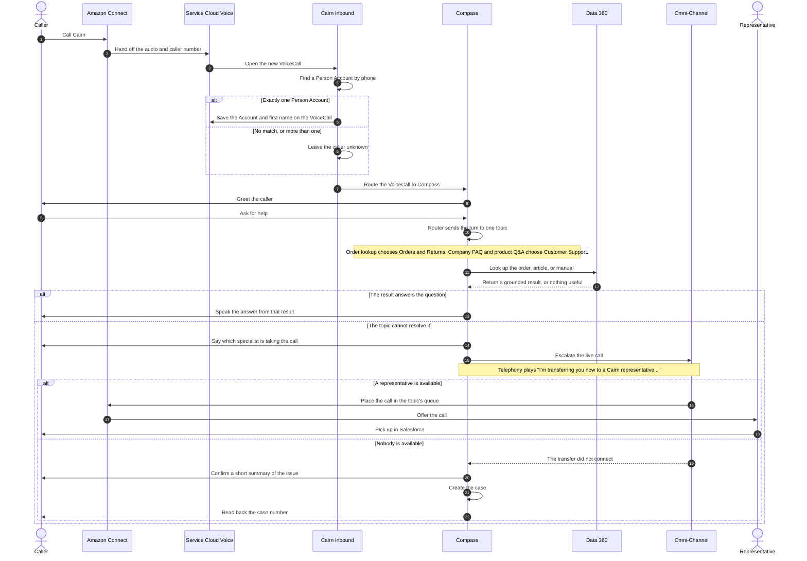

# Cairn Outdoor Co. — Agentforce Voice Demo

Salesforce DX project for a live-build **Agentforce Voice** demo, recorded for the
[CodeWithSally](https://www.youtube.com/@CodeWithSally) YouTube channel. Built with
Cursor and Claude Code.

The scenario: **Cairn Outdoor Co.**, a fictitious direct-to-consumer outdoor gear
retailer whose call center runs on Amazon Connect + Salesforce Service Cloud Voice
with two human-only queues (English and Spanish). The demo adds an Agentforce Voice
service agent in front of that stack — order lookup, company FAQs, product Q&A
grounded in real product manuals via a Data360 data graph, and escalation to a human
agent or case creation when the agent can't help.

- **What we're building**: [`docs/REQUIREMENTS.md`](docs/REQUIREMENTS.md) — the
  fictitious scenario, sample data spec, and agent use cases.
- **How we're building it**: [`docs/SETUP_GUIDE.md`](docs/SETUP_GUIDE.md) — org
  setup, data loading, agent build steps, run-of-show for the recording.
- Repo tracked at [github.com/dangt85/sally-afv](https://github.com/dangt85/sally-afv).

## Architecture

Two views of the same Compass agent. Amazon Connect is the phone system in the
build. Agentforce Contact Center is the alternate, with Salesforce as the phone
system.

### Salesforce + Amazon Connect


### Agentforce Contact Center


### Call and escalation

A call reaches Compass through Amazon Connect and Service Cloud Voice. Compass
answers when Data 360 can ground it. When it cannot, Compass escalates the live
call into the topic's queue, and a representative picks up in Salesforce.



The router never answers. It only sends the caller to Order Lookup, Company FAQ,
or Product Q&A, and that topic sets the queue before it tries to help. Escalation
is a separate hand-off: the topic tells the caller and invokes the transfer in
the same turn. On Agentforce Contact Center the same Compass path applies, and
the queue stays inside Salesforce instead of returning to Amazon Connect.

## Orgs

Two Salesforce **sandbox** orgs, aliased as below:

| Alias | Purpose |
|---|---|
| `sally-prep` | Build and rehearse everything here first. |
| `sally-demo` | Kept clean; built from scratch live, on camera. |

```bash
sf org login web --alias sally-prep
sf org login web --alias sally-demo
```

Always pass `--target-org sally-prep` or `--target-org sally-demo` explicitly when
running `sf` commands against a specific org.

## Prerequisites

- **Salesforce CLI** (`sf`). Download and install it from
  [developer.salesforce.com/tools/sfdxcli](https://developer.salesforce.com/tools/sfdxcli).
- **VS Code** with the **Salesforce Extensions** pack and the **Agentforce DX**
  extension — see
  [Install Pro-Code Tools](https://developer.salesforce.com/docs/ai/agentforce/guide/agent-dx-set-up-env.html)
  — or **Cursor** / **Claude Code** for the pro-code build (see `CLAUDE.md`).
- Both sandbox orgs Agentforce- and Data Cloud (Data360)-enabled, with Person
  Accounts enabled and an Amazon Connect instance already wired up via Salesforce
  Service Cloud Voice. Full prerequisite list in
  [`docs/SETUP_GUIDE.md`](docs/SETUP_GUIDE.md#1-prerequisites).

## Deploying Metadata

```bash
sf project deploy start --target-org sally-prep
```

## Enable Skills in Agentforce Vibes to Vibe Code Agents

To vibe code agents using Agentforce Vibes, first open the Agentforce Vibes panel.
Click the **Manage Skills, Rules, Workflows, and Hooks** icon, then the **Skills**
tab, and ensure these skills are enabled:

- `developing-agentforce`
- `observing-agentforce`
- `testing-agentforce`

### Using Cursor or Claude Code Instead

If you prefer Claude Code or Cursor over Agentforce Vibes, copy these skills from the
`sf-skills` GitHub repository into the appropriate directory for your tool:

- [`developing-agentforce`](https://github.com/forcedotcom/sf-skills/tree/main/skills/developing-agentforce)
- [`observing-agentforce`](https://github.com/forcedotcom/sf-skills/tree/main/skills/observing-agentforce)
- [`testing-agentforce`](https://github.com/forcedotcom/sf-skills/tree/main/skills/testing-agentforce)

## What's Inside This DX Project?

This project was scaffolded from Salesforce's Agentforce DX starter template, which
ships a sample agent (**Local Info Agent** — local weather, events, and resort hours)
as a working example of Agent Script. It's scaffold only, not part of the Cairn
Outdoor Co. demo — it'll be replaced as the real agent is built out per
`docs/REQUIREMENTS.md` and `docs/SETUP_GUIDE.md`.

| Component | Type | Purpose |
|---|---|---|
| `Local_Info_Agent.agent` | Agent Script | Starter template agent — tools, reasoning, variables, flow control. |
| `CheckWeather` | Apex Class | Invocable Apex example. |
| `CurrentDate` | Apex Class | Invocable Apex example. |
| `WeatherService` | Apex Class | Mock data example. |
| `Get_Event_Info` | Prompt Template | Prompt template example. |
| `Get_Resort_Hours` | Flow | Flow example. |
| `Resort_Agent` / `Resort_Admin` | Permission Sets | Starter template permission sets. |
| `AFDX_Agent_Perms` / `AFDX_User_Perms` | Permission Set Groups | Starter template permission set groups. |

## Read All About It

- [Agentforce DX Developer Guide](https://developer.salesforce.com/docs/einstein/genai/guide/agent-dx.html)
- [Agent Script](https://developer.salesforce.com/docs/ai/agentforce/guide/agent-script.html)
- [Agentforce Vibes Extension](https://developer.salesforce.com/docs/platform/einstein-for-devs/guide/einstein-overview.html)
- [Salesforce Extensions for VS Code](https://developer.salesforce.com/docs/platform/sfvscode-extensions/guide)
- [Salesforce CLI Setup Guide](https://developer.salesforce.com/docs/atlas.en-us.sfdx_setup.meta/sfdx_setup/sfdx_setup_intro.htm)
- [Salesforce DX Developer Guide](https://developer.salesforce.com/docs/atlas.en-us.sfdx_dev.meta/sfdx_dev/sfdx_dev_intro.htm)
- [Salesforce CLI Command Reference](https://developer.salesforce.com/docs/atlas.en-us.sfdx_cli_reference.meta/sfdx_cli_reference/cli_reference.htm)
