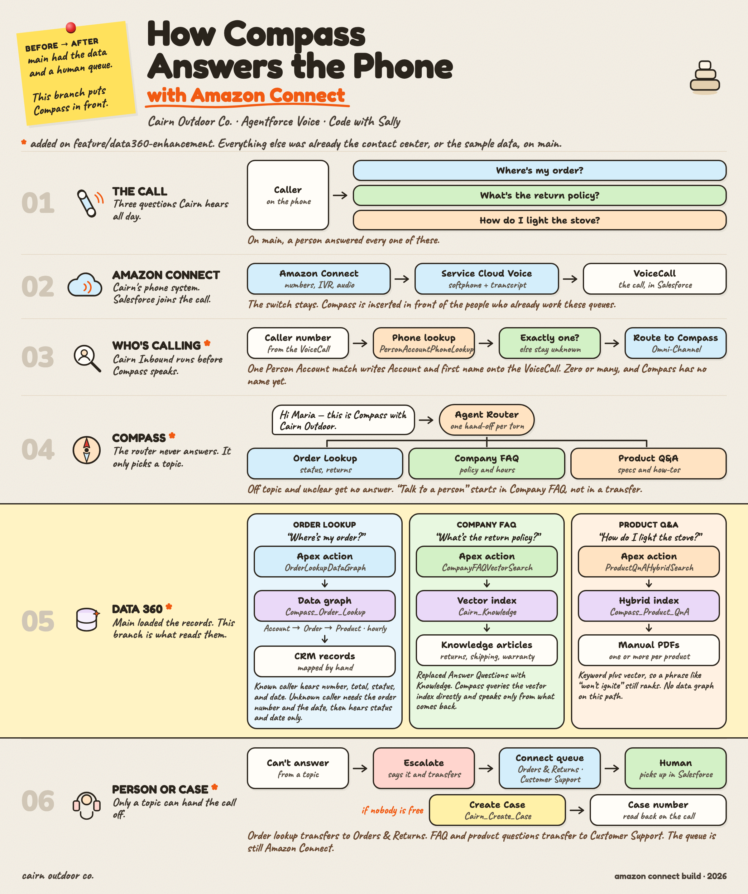
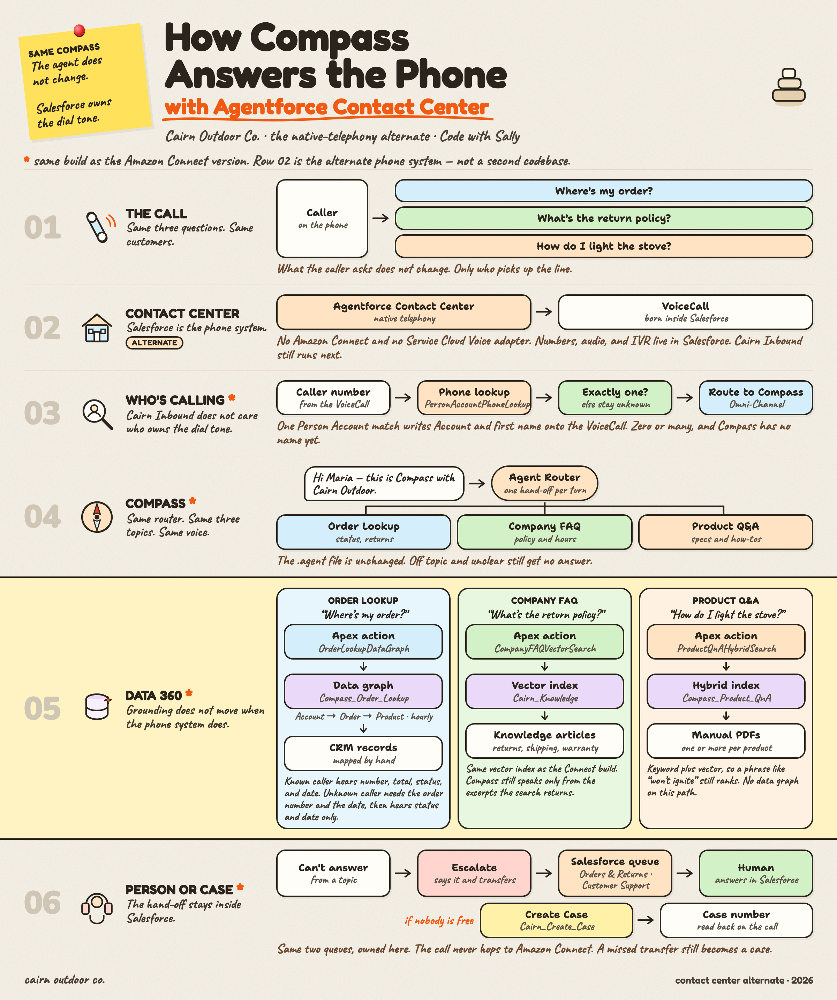
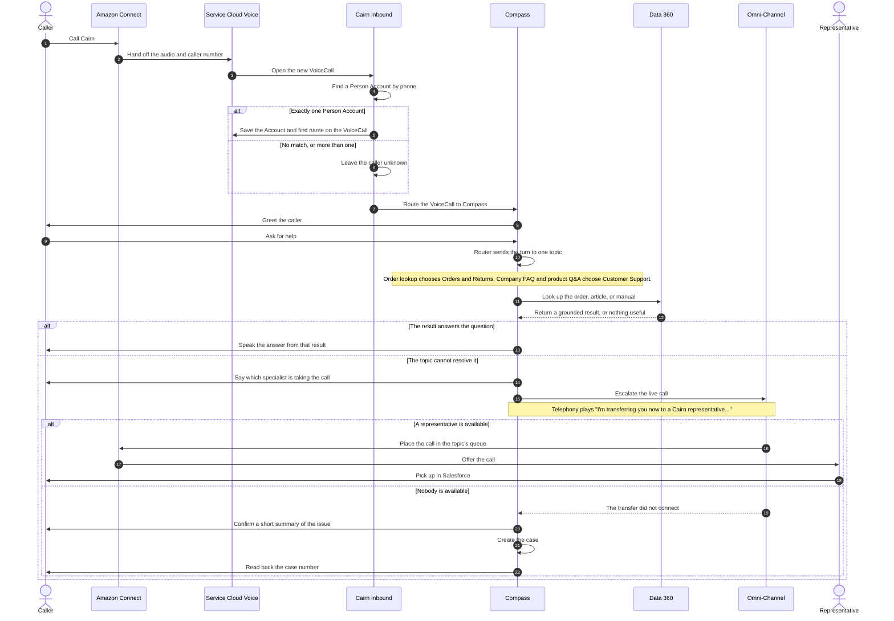

# Cairn Outdoor Co. — Agentforce Voice Demo

Salesforce DX project for a live-build **Agentforce Voice** demo, recorded for the
[CodeWithSally](https://www.youtube.com/@CodeWithSally) YouTube channel. Built with
Cursor and Claude Code.

The scenario: **Cairn Outdoor Co.**, a fictitious direct-to-consumer outdoor gear
retailer whose call center runs on Amazon Connect + Salesforce Service Cloud Voice
with two human-only queues (English and Spanish). The demo adds an Agentforce Voice
service agent in front of that stack — order lookup grounded in a Data360 data graph,
company FAQs and product Q&A grounded in real Knowledge articles and product manuals
via Data Cloud vector search, and escalation to a human agent or case creation when
the agent can't help.

Each grounding approach is built in stages on camera, so the demo shows _why_ each
upgrade matters — see [`docs/REQUIREMENTS.md`](docs/REQUIREMENTS.md) §5.

- **What we're building**: [`docs/REQUIREMENTS.md`](docs/REQUIREMENTS.md) — the
  fictitious scenario, sample data spec, and agent use cases.
- **How we're building it**: [`docs/SETUP_GUIDE.md`](docs/SETUP_GUIDE.md) — org
  setup, data loading, agent build steps, run-of-show for the recording.
- **The five hours**: [`docs/presentations/`](docs/presentations/) — one short deck
  per session. Repo tracked at [github.com/dangt85/sally-afv](https://github.com/dangt85/sally-afv).

## The five sessions

Each hour has a before branch and an after branch. Check out the before branch at
the start of that hour. The after branch is where the hour lands. The next hour's
before branch is the same commit as this hour's after branch. `main` is the end of
hour 5.

| Hour | Before                             | After                             | What lands                                                                                                                                         |
| ---- | ---------------------------------- | --------------------------------- | -------------------------------------------------------------------------------------------------------------------------------------------------- |
| 1    | `show/01-before-a-person-answers`  | `show/01-after-a-person-answers`  | Amazon Connect and Salesforce Voice. A person answers. No agent.                                                                                   |
| 2    | `show/02-before-the-agent-answers` | `show/02-after-the-agent-answers` | Compass greets, then transfers to the person from hour 1.                                                                                          |
| 3    | `show/03-before-wheres-my-order`   | `show/03-after-wheres-my-order`   | Orders. A known caller is recognized by phone. An unknown caller proves the order. The lookup is the Flow.                                         |
| 4    | `show/04-before-return-policy`     | `show/04-after-return-policy`     | The return policy, from the FAQ articles. The hour builds the prompt-template retriever on camera, then leaves the faster Apex retriever in place. |
| 5    | `show/05-before-the-manual`        | `show/05-after-the-manual`        | A product question from the manual, then order lookup moves to the data graph.                                                                     |

Hour 5's after branch is `main`. Agentforce Contact Center is the coda in the hour 5
deck, not a sixth branch.

## Architecture

Two views of the same Compass agent. Amazon Connect is the phone system in the
build. Agentforce Contact Center is the alternate, with Salesforce as the phone
system.

### Salesforce + Amazon Connect



### Agentforce Contact Center



### Call and escalation

A call reaches Compass through Amazon Connect and Service Cloud Voice. Compass
answers when Data 360 can ground it. When it cannot, Compass escalates the live
call into the topic's queue, and a representative picks up in Salesforce.



The router never answers. It only sends the caller to Order Lookup, Company FAQ,
or Product Q&A, and that topic sets the queue before it tries to help. Escalation
is a separate hand-off: the topic tells the caller and invokes the transfer in
the same turn. On Agentforce Contact Center the same Compass path applies, and
the queue stays inside Salesforce instead of returning to Amazon Connect.

## Orgs

Two Salesforce **sandbox** orgs, aliased as below:

| Alias        | Purpose                                         |
| ------------ | ----------------------------------------------- |
| `sally-prep` | Build and rehearse everything here first.       |
| `sally-demo` | Kept clean; built from scratch live, on camera. |

```bash
sf org login web --alias sally-prep
sf org login web --alias sally-demo
```

Always pass `--target-org sally-prep` or `--target-org sally-demo` explicitly when
running `sf` commands against a specific org.

## Prerequisites

- **Salesforce CLI** (`sf`). Download and install it from
  [developer.salesforce.com/tools/sfdxcli](https://developer.salesforce.com/tools/sfdxcli).
- **VS Code** with the **Salesforce Extensions** pack and the **Agentforce DX**
  extension — see
  [Install Pro-Code Tools](https://developer.salesforce.com/docs/ai/agentforce/guide/agent-dx-set-up-env.html)
  — or **Cursor** / **Claude Code** for the pro-code build (see `CLAUDE.md`).
- Both sandbox orgs Agentforce- and Data Cloud (Data360)-enabled, with Person
  Accounts enabled and an Amazon Connect instance already wired up via Salesforce
  Service Cloud Voice. Full prerequisite list in
  [`docs/SETUP_GUIDE.md`](docs/SETUP_GUIDE.md#1-prerequisites).

## Deploying Metadata

```bash
sf project deploy start --target-org sally-prep
```

## Enable Skills in Agentforce Vibes to Vibe Code Agents

To vibe code agents using Agentforce Vibes, first open the Agentforce Vibes panel.
Click the **Manage Skills, Rules, Workflows, and Hooks** icon, then the **Skills**
tab, and ensure these skills are enabled:

- `developing-agentforce`
- `observing-agentforce`
- `testing-agentforce`

### Using Cursor or Claude Code Instead

If you prefer Claude Code or Cursor over Agentforce Vibes, copy these skills from the
`sf-skills` GitHub repository into the appropriate directory for your tool:

- [`developing-agentforce`](https://github.com/forcedotcom/sf-skills/tree/main/skills/developing-agentforce)
- [`observing-agentforce`](https://github.com/forcedotcom/sf-skills/tree/main/skills/observing-agentforce)
- [`testing-agentforce`](https://github.com/forcedotcom/sf-skills/tree/main/skills/testing-agentforce)

## What's Inside This DX Project?

The project was scaffolded from Salesforce's Agentforce DX starter template. That
template's sample agent (**Local Info Agent**) and its example Apex/Flow/prompt
components have been removed — everything below is Cairn Outdoor Co.'s own build.

| Component                                                     | Type                | Purpose                                                                                                       |
| ------------------------------------------------------------- | ------------------- | ------------------------------------------------------------------------------------------------------------- |
| `Cairn_Compass`                                               | Agent Script bundle | The voice agent: router plus `order_lookup`, `company_faq`, `product_qa`, `escalate_to_agent`, `create_case`. |
| `OrderLookupDataGraph`                                        | Apex Class          | `order_lookup`'s action at the end of the series. Queries the Data360 data graph via `ConnectApi.CdpQuery`.   |
| `CompanyFAQVectorSearch`                                      | Apex Class          | `company_faq`'s action. Queries the Cairn Knowledge vector index.                                             |
| `ProductQnAHybridSearch`                                      | Apex Class          | `product_qa`'s action. Queries the product-manual hybrid index.                                               |
| `PersonAccountPhoneLookup`                                    | Apex Class          | Matches an inbound caller's ANI to a Person Account.                                                          |
| `Cairn_Inbound` / `Cairn_Outbound`                            | Flows               | Service Cloud Voice call handling; `Cairn_Inbound` sets `VoiceCall.Account__c` on a single ANI match.         |
| `Cairn_Order_Lookup`                                          | Flow                | Hour 3 order lookup. Known caller by Account, or order number plus the date it was placed.                    |
| `Cairn_Create_Case`                                           | Flow                | Creates a `Case` when escalation isn't possible.                                                              |
| `Order.Fulfillment_Status__c` / `.Estimated_Delivery_Date__c` | Custom Fields       | Order status details the agent reports back.                                                                  |
| `VoiceCall.Account__c` / `.ContactName__c`                    | Custom Fields       | Carry the ANI-matched caller into the agent as linked variables.                                              |
| `Account.Preferred_Language__c`                               | Custom Field        | On the sample Person Accounts. Escalation queues are `Orders_Returns` and `Customer_Support`.                 |
| `Cairn_Voice_Agent` / `Cairn_Data_Load`                       | Permission Sets     | Runtime access for the agent user; sample-data load access.                                                   |

> **Note:** `Cairn_Voice_Agent.permissionset-meta.xml` is listed in `.prettierignore`.
> `@prettier/plugin-xml` rewrites its `<flow>` text nodes with a trailing semicolon,
> which the Metadata API then rejects. Don't remove that exclusion.

## Read All About It

- [Agentforce DX Developer Guide](https://developer.salesforce.com/docs/einstein/genai/guide/agent-dx.html)
- [Agent Script](https://developer.salesforce.com/docs/ai/agentforce/guide/agent-script.html)
- [Agentforce Vibes Extension](https://developer.salesforce.com/docs/platform/einstein-for-devs/guide/einstein-overview.html)
- [Salesforce Extensions for VS Code](https://developer.salesforce.com/docs/platform/sfvscode-extensions/guide)
- [Salesforce CLI Setup Guide](https://developer.salesforce.com/docs/atlas.en-us.sfdx_setup.meta/sfdx_setup/sfdx_setup_intro.htm)
- [Salesforce DX Developer Guide](https://developer.salesforce.com/docs/atlas.en-us.sfdx_dev.meta/sfdx_dev/sfdx_dev_intro.htm)
- [Salesforce CLI Command Reference](https://developer.salesforce.com/docs/atlas.en-us.sfdx_cli_reference.meta/sfdx_cli_reference/cli_reference.htm)
